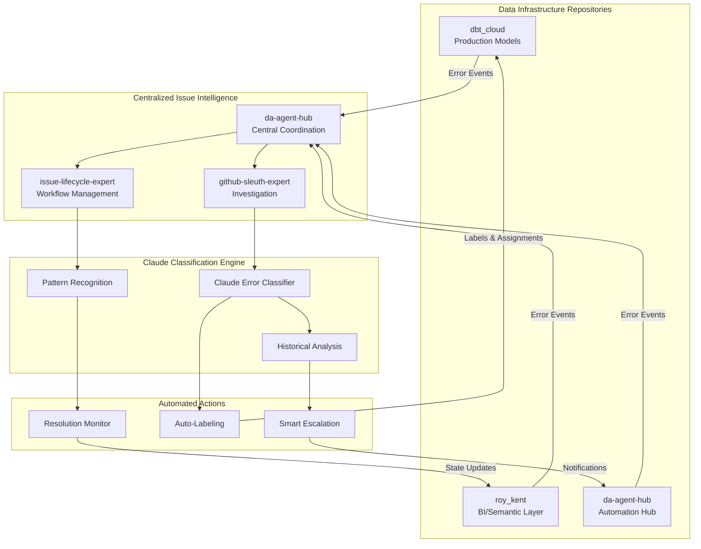

# Cross-Repository Issue Tracking Architecture

## Overview

This document defines the intelligent issue tracking system that works across all data infrastructure repositories: **dbt_cloud**, **roy_kent**, and **da-agent-hub**. The system uses Claude-powered classification and automated workflows to reduce noise from transient failures and improve issue resolution efficiency.

## Architecture Components



## Repository-Specific Error Monitoring

### 1. dbt_cloud Repository (Production Critical)
```yaml
repository_config:
  name: "dbt_cloud"
  priority_level: "critical"
  error_sources:
    - dbt_cloud_api
    - github_actions_workflows
    - manual_reports

  automation_rules:
    schema_errors:
      priority: "critical"
      auto_assign: "dbt-expert"
      sla_hours: 4
      escalate_after: 8

    test_failures:
      priority: "high"
      auto_assign: "dbt-expert"
      sla_hours: 24
      pattern_check: true

    performance_issues:
      priority: "medium"
      auto_assign: "snowflake-expert"
      sla_hours: 48
      cost_impact_analysis: true
```

### 2. roy_kent Repository (Business Intelligence)
```yaml
repository_config:
  name: "roy_kent"
  priority_level: "high"
  error_sources:
    - dbt_cloud_api
    - semantic_layer_api
    - tableau_integration

  automation_rules:
    metric_calculation_errors:
      priority: "high"
      auto_assign: "dbt-expert"
      notify_business_team: true
      sla_hours: 24

    dashboard_failures:
      priority: "medium"
      auto_assign: "tableau-expert"
      sla_hours: 48

    semantic_layer_issues:
      priority: "high"
      auto_assign: "dbt-expert"
      requires_business_context: true
```

### 3. da-agent-hub Repository (Automation & Coordination)
```yaml
repository_config:
  name: "da-agent-hub"
  priority_level: "medium"
  error_sources:
    - github_actions
    - claude_api_integration
    - workflow_failures

  automation_rules:
    workflow_failures:
      priority: "medium"
      auto_assign: "github-sleuth-expert"
      self_healing_attempt: true

    agent_coordination_issues:
      priority: "low"
      auto_assign: "issue-lifecycle-expert"
      pattern_analysis: true

    api_integration_errors:
      priority: "medium"
      auto_assign: "da-architect"
      external_dependency_check: true
```

## Claude-Powered Error Classification System

### Classification Workflow
```yaml
claude_classification:
  trigger_events:
    - new_issue_created
    - error_pattern_detected
    - recurring_issue_identified

  classification_process:
    1. initial_triage:
        - extract_error_details
        - identify_affected_systems
        - assess_immediate_impact

    2. pattern_analysis:
        - search_similar_historical_issues
        - analyze_resolution_patterns
        - calculate_recurrence_probability

    3. classification_decision:
        - assign_error_category
        - determine_priority_level
        - recommend_expert_assignment

    4. action_planning:
        - suggest_immediate_actions
        - define_monitoring_strategy
        - set_escalation_triggers
```

### Error Categories & Auto-Actions
```yaml
error_categories:
  transient_failure:
    description: "Self-resolving errors (network, timeouts, resource contention)"
    auto_actions:
      - monitor_next_3_runs
      - auto_close_if_resolved
      - label: "transient"
    typical_resolution_time: "6 hours"

  code_fix_required:
    description: "Errors requiring code changes (schema, logic, config)"
    auto_actions:
      - assign_domain_expert
      - require_pr_for_resolution
      - label: "code-fix"
    typical_resolution_time: "1-3 days"

  data_quality_issue:
    description: "Problems with source data quality"
    auto_actions:
      - notify_data_team
      - check_upstream_systems
      - label: "data-quality"
    typical_resolution_time: "2-5 days"

  infrastructure_issue:
    description: "Platform or warehouse-level problems"
    auto_actions:
      - escalate_to_platform_team
      - check_system_status
      - label: "infrastructure"
    typical_resolution_time: "Variable"

  false_positive:
    description: "Not actual errors, monitoring noise"
    auto_actions:
      - auto_close
      - adjust_monitoring_rules
      - label: "false-positive"
    typical_resolution_time: "Immediate"
```

## Issue Metadata Framework

### Standard Issue Metadata
```yaml
issue_metadata:
  # Classification Data
  error_fingerprint: "md5_hash_of_normalized_error"
  error_category: "transient_failure|code_fix_required|data_quality_issue|infrastructure_issue|false_positive"
  priority_level: "critical|high|medium|low"
  complexity_score: 1-10

  # Tracking Data
  first_occurrence: "2025-01-18T10:00:00Z"
  last_occurrence: "2025-01-18T14:00:00Z"
  occurrence_count: 3
  affected_models: ["stg_customers", "dm_customer_metrics"]
  affected_repositories: ["dbt_cloud"]

  # Resolution Data
  resolution_pattern: "auto_resolved|pr_merged|data_fixed|infra_resolved|false_alarm"
  time_to_first_response: "2 hours"
  time_to_resolution: "8 hours"
  resolution_confidence: 0.95

  # Cross-Reference Data
  similar_issues: [342, 339, 335]
  related_prs: ["#156", "#159"]
  expert_assignments: ["dbt-expert", "snowflake-expert"]
```

### Issue Metadata Template
```markdown
<!-- CLAUDE_METADATA
{
  "error_fingerprint": "abc123def456",
  "error_category": "pending_classification",
  "priority_level": "medium",
  "complexity_score": 5,
  "first_occurrence": "2025-01-18T10:00:00Z",
  "last_occurrence": "2025-01-18T14:00:00Z",
  "occurrence_count": 1,
  "affected_models": ["stg_customers"],
  "affected_repositories": ["dbt_cloud"],
  "resolution_pattern": "monitoring",
  "similar_issues": [],
  "related_prs": [],
  "expert_assignments": [],
  "claude_classification_confidence": 0.0,
  "auto_actions_taken": [],
  "next_check_time": "2025-01-18T16:00:00Z"
}
-->
```

## Enhanced GitHub Actions Workflows

### 1. Central Error Classification Workflow
**File**: `.github/workflows/claude-error-classifier.yml`

```yaml
name: Claude Error Classification

on:
  repository_dispatch:
    types: [error-detected]
  issues:
    types: [opened]

jobs:
  classify-error:
    runs-on: ubuntu-latest

    steps:
    - name: Extract Error Context
      id: context
      run: |
        # Extract repository, error details, affected systems
        echo "repository=${{ github.event.client_payload.repository || github.repository }}" >> $GITHUB_OUTPUT
        echo "error_details=${{ github.event.client_payload.error_details || github.event.issue.body }}" >> $GITHUB_OUTPUT

    - name: Claude Classification
      uses: anthropics/claude-code-action@v1
      with:
        claude_args: "--agent github-sleuth-expert"
        prompt: |
          Classify this error and recommend actions:

          Repository: ${{ steps.context.outputs.repository }}
          Error Details: ${{ steps.context.outputs.error_details }}

          Please:
          1. Classify the error type and priority
          2. Recommend expert assignment
          3. Suggest immediate actions
          4. Set monitoring strategy

    - name: Apply Classification Results
      run: |
        # Apply labels, assignments, and metadata based on Claude's analysis
        # This will be implemented based on Claude's output format
```

### 2. Auto-Resolution Monitor
**File**: `.github/workflows/auto-resolution-monitor.yml`

```yaml
name: Auto Resolution Monitor

on:
  schedule:
    - cron: '0 */6 * * *'  # Every 6 hours
  workflow_dispatch:

jobs:
  check-resolutions:
    runs-on: ubuntu-latest

    strategy:
      matrix:
        repository: [dbt_cloud, roy_kent, da-agent-hub]

    steps:
    - name: Check Repository Issues
      uses: anthropics/claude-code-action@v1
      with:
        claude_args: "--agent issue-lifecycle-expert"
        prompt: |
          Check for auto-resolvable issues in ${{ matrix.repository }}:

          1. Find open issues with monitoring labels
          2. Check if errors have self-resolved
          3. Update issue states accordingly
          4. Generate resolution metrics
```

### 3. Cross-Repository Pattern Analysis
**File**: `.github/workflows/pattern-analysis.yml`

```yaml
name: Cross-Repository Pattern Analysis

on:
  schedule:
    - cron: '0 2 * * *'  # Daily at 2 AM
  workflow_dispatch:

jobs:
  analyze-patterns:
    runs-on: ubuntu-latest

    steps:
    - name: Cross-Repository Analysis
      uses: anthropics/claude-code-action@v1
      with:
        claude_args: "--agent github-sleuth-expert"
        prompt: |
          Analyze error patterns across all repositories:

          1. Identify recurring patterns across dbt_cloud, roy_kent, da-agent-hub
          2. Look for cross-system correlation
          3. Suggest workflow improvements
          4. Update automation rules
```

## Implementation Plan

### Phase 1: Core Infrastructure (Week 1)
1. **Deploy New Agents**: Add github-sleuth-expert and issue-lifecycle-expert
2. **Create Metadata Schema**: Implement standard issue metadata framework
3. **Basic Classification**: Deploy Claude error classifier workflow

### Phase 2: Cross-Repository Integration (Week 2)
1. **Multi-Repo Workflows**: Set up central coordination in da-agent-hub
2. **Pattern Recognition**: Implement historical pattern analysis
3. **Auto-Resolution**: Deploy resolution monitoring workflows

### Phase 3: Intelligence Enhancement (Week 3)
1. **Advanced Classification**: Improve Claude prompts based on initial patterns
2. **Cross-System Correlation**: Detect issues spanning multiple repositories
3. **Predictive Insights**: Identify potential issues before they occur

### Phase 4: Optimization & Monitoring (Week 4)
1. **Performance Metrics**: Implement dashboards and reporting
2. **Workflow Refinement**: Optimize based on real usage patterns
3. **Documentation**: Complete user guides and troubleshooting docs

## Success Metrics

### Efficiency Metrics
- **Issue Response Time**: < 2 hours for initial triage
- **Auto-Resolution Rate**: > 30% for transient issues
- **False Positive Reduction**: > 50% noise reduction
- **Expert Assignment Accuracy**: > 90% correct assignments

### Quality Metrics
- **First-Time Resolution Rate**: > 80% issues resolved on first attempt
- **Escalation Accuracy**: < 10% unnecessary escalations
- **Cross-Repository Correlation**: > 85% pattern detection accuracy
- **Time to Resolution**: 40% reduction in average resolution time

### User Experience Metrics
- **Expert Satisfaction**: Reduced context switching, clearer assignments
- **Issue Reporter Satisfaction**: Faster responses, better communication
- **Operational Efficiency**: Reduced manual triage work by 60%

This architecture provides intelligent, automated issue management while maintaining human oversight for complex problems and ensuring continuous improvement through pattern learning.